# UX Design Specification Portfolio

**Author:** Opsa
**Date:** 2025-12-10

---

## Executive Summary

### Project Vision

Portfolio is a minimalistic, animation-rich personal portfolio website designed to help a full-stack web developer win freelance work on Upwork. The site serves as a trust-building tool where the portfolio's own visual excellence becomes the primary proof of skill—convincing potential clients before they even review individual projects.

The key success moment: A client views the portfolio for 30-60 seconds, browses a project demo, and returns to Upwork ready to hire.

### Target Users

| User Persona             | Profile                                                    | Primary Need                        | Success Criteria                             |
| ------------------------ | ---------------------------------------------------------- | ----------------------------------- | -------------------------------------------- |
| **The Decisive Founder** | Non-technical startup founders evaluating Upwork proposals | Quick visual proof of quality       | "This is exactly what I want for my project" |
| **The Skeptical CTO**    | Technical evaluators who dig into code quality             | GitHub access, clean implementation | Code quality passes inspection               |
| **Mobile Evaluators**    | Same users checking on different devices                   | Cross-device consistency            | Works as well on phone as desktop            |

### Key Design Challenges

1. **The 5-Second Test** — Immediate quality perception required; hero section must communicate excellence through typography, animation, and visual polish
2. **Trust Without Overwhelm** — Build confidence quickly without requiring deep engagement; every scroll position should reinforce competence
3. **Dual Audience Harmony** — Serve both non-technical founders (visual proof) and technical evaluators (code access) without fragmented experience
4. **Animation Calibration** — Hit the "premium but restrained" sweet spot; too subtle = forgettable, too flashy = unprofessional

### Design Opportunities

1. **Portfolio as Proof** — The site's execution IS the demonstration of skill; animations, performance, and polish become the strongest hiring argument
2. **Scroll-Driven Confidence** — Use scroll-triggered reveals to create guided experience that builds trust progressively
3. **Microinteraction Excellence** — Hover effects and smooth interactions signal attention to detail that templates can't match
4. **Performance Differentiation** — Fast loading and 60fps animations become competitive advantage against janky competitor sites

---

## Core User Experience

### Defining Experience

The core user action for Portfolio is **scanning for proof of quality**. Visitors aren't "using" the portfolio in a traditional sense—they're evaluating the developer in 30-60 seconds. Every design decision must support rapid trust-building.

**Core Interaction Flow:**
```
Land → Perceive Quality (5s) → Scan Projects (30s) → Verify Proof → Decide → Return to Upwork
```

The portfolio functions as a **trust acceleration tool** that converts proposal views into confident hiring decisions.

### Platform Strategy

| Aspect                 | Decision                                          | Rationale                                                |
| ---------------------- | ------------------------------------------------- | -------------------------------------------------------- |
| **Primary Platform**   | Responsive web (desktop + mobile)                 | Clients check on desktop during reviews, share on mobile |
| **Priority Browsers**  | Chrome, Firefox, Safari, Edge (latest 2 versions) | Standard modern browser coverage                         |
| **Touch Support**      | Full touch gestures on mobile                     | Clients often show portfolios during conversations       |
| **Offline**            | Not required                                      | Always accessed via Upwork links with connectivity       |
| **Performance Target** | LCP < 2.5s, 60fps animations                      | Fast loading signals competence                          |

### Effortless Interactions

What should require zero thought:

| Interaction               | Effortless Design                                                   |
| ------------------------- | ------------------------------------------------------------------- |
| **Perceiving quality**    | Hero section communicates excellence instantly; no reading required |
| **Finding project demos** | Obvious buttons, clear visual hierarchy, working links              |
| **Accessing code**        | GitHub links open in new tabs; repository is well-organized         |
| **Contacting**            | Contact form is minimal; email link always visible                  |
| **Mobile browsing**       | Touch targets sized correctly; no pinch-to-zoom required            |

### Critical Success Moments

| Moment                      | Definition                                 | Success Signal                         |
| --------------------------- | ------------------------------------------ | -------------------------------------- |
| **The 5-Second Verdict**    | First impression in hero section           | "This looks professional"              |
| **The "This Works" Moment** | Clicking a live demo and it loads smoothly | "Their projects actually work"         |
| **The Technical Nod**       | CTO finds GitHub, reviews code quality     | "Code is clean, modern practices"      |
| **The Confidence Decision** | Returning to Upwork ready to send message  | "I want this developer for my project" |

### Experience Principles

These principles guide all UX decisions for Portfolio:

| Principle                  | Description                                                                    | Application                                     |
| -------------------------- | ------------------------------------------------------------------------------ | ----------------------------------------------- |
| **Quality Over Quantity**  | Fewer elements, higher polish. Every visible item must reinforce competence.   | Curate 2-3 best projects; remove clutter        |
| **Progressive Confidence** | Each scroll position builds more trust than the last.                          | Hero → Projects → About → Contact flow          |
| **Zero Friction Proof**    | Live demos load instantly; code links open in new tabs; no dead ends.          | All links functional; fast load times           |
| **Animation as Signal**    | Smooth, purposeful animations demonstrate technical skill without distraction. | Scroll reveals, hover effects, page transitions |

---

## Desired Emotional Response

### Primary Emotional Goals

**Primary Emotion: Confidence**
> "This developer clearly knows what they're doing. I feel confident hiring them."

The portfolio's ultimate emotional objective is converting visitor uncertainty into hiring confidence. Every design decision serves this goal.

**Supporting Emotions:**

| Stage                 | Desired Emotion | What Creates It                                             |
| --------------------- | --------------- | ----------------------------------------------------------- |
| **First Landing**     | Impressed       | Smooth animations, polished design, professional typography |
| **Scanning Projects** | Trust           | Working demos, visible tech stacks, GitHub access           |
| **Deeper Review**     | Reassured       | Code quality, modern practices, attention to detail         |
| **Decision Moment**   | Certainty       | All proof points align; no red flags                        |

### Emotional Journey Mapping

```
😮 Impressed → 🤔 Intrigued → ✅ Convinced → 💪 Confident → 📩 Action
```

| Moment           | From        | To        | Design Trigger                              |
| ---------------- | ----------- | --------- | ------------------------------------------- |
| Hero lands       | Neutral     | Impressed | Smooth entrance animation, clean typography |
| See projects     | Curious     | Intrigued | Visual previews, hover interactions         |
| Click demo       | Skeptical   | Convinced | Demo loads fast, works perfectly            |
| Review code      | Uncertain   | Confident | Clean GitHub, modern patterns               |
| Return to Upwork | Considering | Decided   | "I want this developer"                     |

### Micro-Emotions

| Prioritize     | Over       | Why                                                            |
| -------------- | ---------- | -------------------------------------------------------------- |
| **Confidence** | Excitement | Clients are making hiring decisions, not entertainment choices |
| **Trust**      | Delight    | Reliability matters more than wow-factor alone                 |
| **Competence** | Creativity | They need to believe you can deliver their project             |
| **Calm**       | Urgency    | No pressure tactics; let quality speak                         |

**Emotions to Avoid:**
- **Confusion** — Unclear navigation, vague project descriptions
- **Skepticism** — Broken links, placeholder content, slow loading
- **Overwhelm** — Too many projects, visual clutter, competing elements
- **Anxiety** — Aggressive CTAs, pushy sales language

### Design Implications

| Emotion Goal   | UX Design Choice                                                  |
| -------------- | ----------------------------------------------------------------- |
| **Impression** | Hero animation timing (0.3-0.5s), professional font pairing       |
| **Trust**      | All demo links functional, GitHub accessible, tech badges visible |
| **Confidence** | 60fps animations, fast load times, no console errors              |
| **Certainty**  | Simple contact path, clear next steps                             |

### Emotional Design Principles

| Principle                         | Application                                                 |
| --------------------------------- | ----------------------------------------------------------- |
| **Confidence Through Competence** | Every interaction demonstrates skill, not just describes it |
| **Trust Before Transaction**      | Build proof before asking for contact                       |
| **Calm Professionalism**          | No urgency tactics; quality sells itself                    |
| **Delight in Details**            | Micro-interactions create memorable impressions             |

---

## UX Pattern Analysis & Inspiration

### Inspiring Products Analysis

| Site/Pattern                             | What They Do Well                                        | Key UX Insight                                                      |
| ---------------------------------------- | -------------------------------------------------------- | ------------------------------------------------------------------- |
| **Brittany Chiang** (brittanychiang.com) | Clean layout, subtle animations, clear project hierarchy | Single-page flow with smooth scroll reveals creates focused journey |
| **Josh Comeau** (joshwcomeau.com)        | Playful microinteractions, personality through animation | Hover effects that signal "developer who cares about details"       |
| **Cassie Evans** (cassie.codes)          | SVG animations, creative personality showcase            | Animation as signature differentiator                               |
| **Linear.app**                           | Premium SaaS feel, smooth transitions, dark mode polish  | "Enterprise quality" aesthetic builds trust                         |
| **Vercel.com**                           | Clean docs, fast performance, modern Next.js patterns    | Technical credibility through execution quality                     |

### Transferable UX Patterns

**Navigation Patterns:**
- Single-page scroll with sticky nav — ideal for short portfolios
- Smooth anchor links with scroll-margin — projects, about, contact sections

**Interaction Patterns:**
- Scroll-triggered fade-ins (`whileInView`) — section reveals as user scrolls
- Hover scale + shadow on project cards — interactive feedback
- Staggered children animations — sequential element entrances
- Page transitions with AnimatePresence — smooth route changes

**Visual Patterns:**
- Hero with animated text reveal — name/title entrance sequence
- Project tiles with visual previews — proof before click
- Tech stack badges — quick skill verification
- Prominent GitHub/LinkedIn links — credibility access points

### Anti-Patterns to Avoid

| Anti-Pattern              | Why It Fails                           | Alternative                 |
| ------------------------- | -------------------------------------- | --------------------------- |
| **Too many projects**     | Overwhelms, dilutes quality perception | Curate 2-3 best only        |
| **Placeholder content**   | Screams "unfinished"                   | Only ship what's real       |
| **Slow loading**          | Signals poor dev skills                | Optimize everything         |
| **Aggressive animations** | Feels unprofessional                   | Subtle, purposeful motion   |
| **Generic template look** | Doesn't differentiate                  | Custom touches, personality |
| **Broken demo links**     | Destroys trust instantly               | Test everything             |

### Design Inspiration Strategy

| Category  | Decision                                                       | Rationale                                         |
| --------- | -------------------------------------------------------------- | ------------------------------------------------- |
| **Adopt** | Scroll-triggered reveals, hover interactions, single-page flow | Proven patterns that enhance without overwhelming |
| **Adapt** | Brittany Chiang's clean layout + Framer Motion polish          | Minimalist foundation with animation excellence   |
| **Avoid** | Over-personalization, complex navigation, dark-mode-only       | Keep focus on credibility over gimmicks           |

---

## Design System Foundation

### Design System Choice

**Selected Approach:** Custom CSS/Tailwind

For Portfolio, we're using a custom design system built with CSS Modules or Tailwind CSS utility classes, paired with Framer Motion for all animations. This approach maximizes visual uniqueness and demonstrates deeper front-end skills.

### Rationale for Selection

| Factor                 | Decision Rationale                                                                                   |
| ---------------------- | ---------------------------------------------------------------------------------------------------- |
| **Portfolio as Proof** | Using a component library would undermine the credibility message; hand-crafted CSS shows real skill |
| **Minimalist Scope**   | Only need 5-6 component types: Hero, Project Cards, About, Contact Form, Nav, Footer                 |
| **Animation Focus**    | Framer Motion handles interactions; no need for UI library animation defaults                        |
| **Credibility Signal** | Custom implementation demonstrates ability to build without scaffolding                              |
| **Performance**        | No unused component library code; bundle stays minimal                                               |

### Implementation Approach

| Aspect             | Approach                                                        |
| ------------------ | --------------------------------------------------------------- |
| **Styling Method** | CSS Modules (scoped) or Tailwind CSS (utility-first)            |
| **Design Tokens**  | CSS custom properties for colors, spacing, typography, shadows  |
| **Components**     | Minimal set: Hero, ProjectCard, Section, Button, Input, Badge   |
| **Animations**     | 100% Framer Motion — no CSS animations for interactive elements |
| **Responsive**     | Mobile-first breakpoints with fluid typography                  |

### Customization Strategy

**Design Tokens to Define:**
```
--color-primary
--color-background, --color-surface
--color-text-primary, --color-text-secondary
--font-heading, --font-body
--spacing-unit (4px base)
--radius-sm, --radius-md, --radius-lg
--shadow-sm, --shadow-md, --shadow-lg
--transition-fast, --transition-normal
```

**Component Strategy:**
- Build only what's needed; no kitchen-sink component library
- Each component has clear animation variants via Framer Motion
- Accessibility baked in (keyboard nav, focus states, reduced-motion support)

---

## Defining Core Experience

### The Defining Experience

> **"See quality, feel confident, hire without doubt"**

The defining interaction is the **5-second hero impression** — the moment a client lands and immediately perceives "this developer knows what they're doing." Every other element supports this critical first moment.

### User Mental Model

**How clients currently evaluate developers:**
- Scan proposals quickly (30 seconds each)
- Click portfolio links if provided
- Look for "vibes" — professionalism, quality signals
- Check 1-2 projects for proof
- Make gut decision within 60 seconds

**Mental Model Summary:** "Show me you can build what I need, quickly"

**What clients bring:**
- Skepticism from past bad hires
- Time pressure from multiple proposals
- Non-technical evaluation criteria (vibes, polish, professionalism)
- Need for risk reduction

### Success Criteria

| Criterion             | Success Indicator                              | Design Implication                                |
| --------------------- | ---------------------------------------------- | ------------------------------------------------- |
| **Immediate Quality** | Page animates smoothly; design looks polished  | Hero entrance animation, professional typography  |
| **Proof is Obvious**  | Projects visible without scrolling far         | Project section high in page hierarchy            |
| **Trust Builds Fast** | Demo links work; GitHub is accessible          | All links tested, external links open in new tabs |
| **No Red Flags**      | No broken links, slow loads, or console errors | Performance optimization, error handling          |
| **Clear Next Step**   | Contact/return to Upwork is obvious            | Visible contact section, simple form              |

### Experience Mechanics

**1. Initiation:**
- Client clicks portfolio link from Upwork proposal
- Page loads in <2.5s LCP
- Smooth hero animation begins immediately

**2. Interaction:**
- Hero animates with name, title, brief intro
- Client scrolls down (or anchor-links to Projects)
- Hovers project cards, sees previews with scale/shadow effects
- Clicks demo link, verifies it works in new tab

**3. Feedback:**
- Smooth animations signal technical competence
- Working demos confirm "this person ships"
- Clean GitHub confirms code quality
- 60fps performance throughout

**4. Completion:**
- Client thinks "I want this developer"
- Returns to Upwork to message
- OR uses contact form directly
- OR bookmarks for later comparison

### Pattern Classification

| Category                      | Approach                                                          |
| ----------------------------- | ----------------------------------------------------------------- |
| **Established Patterns**      | Single-page layout, scroll reveals, hover cards, contact form     |
| **Innovation Within Pattern** | Animation quality as differentiator, portfolio execution as proof |
| **Unique Positioning**        | Minimalist focus (2-3 projects only), quality over quantity       |

---

## Visual Design Foundation

### Color System

**Approach:** Neutral-first palette with single accent color for maximum minimalist impact.

**Light Mode Palette:**

| Token                    | Value     | Usage                    |
| ------------------------ | --------- | ------------------------ |
| `--color-background`     | `#FAFAFA` | Page background          |
| `--color-surface`        | `#FFFFFF` | Cards, containers        |
| `--color-text-primary`   | `#1A1A1A` | Headings, important text |
| `--color-text-secondary` | `#6B7280` | Body text, descriptions  |
| `--color-accent`         | `#3B82F6` | Links, CTAs, highlights  |
| `--color-border`         | `#E5E7EB` | Subtle borders           |
| `--color-hover`          | `#2563EB` | Accent hover state       |

**Semantic Colors:**
- Success: `#10B981`
- Warning: `#F59E0B`
- Error: `#EF4444`

### Typography System

**Font Stack:**
- **Primary:** Inter (or Outfit for more personality)
- **Monospace:** JetBrains Mono (tech stack badges, code)

**Type Scale (1.25 ratio):**

| Token              | Size | Usage                |
| ------------------ | ---- | -------------------- |
| `--font-size-xs`   | 12px | Labels, badges       |
| `--font-size-sm`   | 14px | Small text, metadata |
| `--font-size-base` | 16px | Body text            |
| `--font-size-lg`   | 18px | Lead paragraphs      |
| `--font-size-xl`   | 20px | Section intros       |
| `--font-size-2xl`  | 24px | H3 headings          |
| `--font-size-3xl`  | 30px | H2 headings          |
| `--font-size-4xl`  | 36px | H1 headings          |
| `--font-size-5xl`  | 48px | Hero text            |

**Font Weights:**
- 400: Body text
- 500: Medium emphasis
- 600: Subheadings
- 700: Headings, hero text

### Spacing & Layout Foundation

**Base Unit:** 4px (Tailwind-compatible)

| Token          | Value | Usage                |
| -------------- | ----- | -------------------- |
| `--spacing-1`  | 4px   | Tight spacing        |
| `--spacing-2`  | 8px   | Default gap          |
| `--spacing-4`  | 16px  | Component padding    |
| `--spacing-6`  | 24px  | Section spacing      |
| `--spacing-8`  | 32px  | Card padding         |
| `--spacing-12` | 48px  | Large gaps           |
| `--spacing-16` | 64px  | Section separation   |
| `--spacing-24` | 96px  | Full section padding |

**Layout Principles:**
- Max content width: 1200px
- Section vertical padding: 96px (desktop), 64px (mobile)
- Card border radius: 8-12px
- Mobile-first responsive breakpoints

### Accessibility Considerations

| Requirement        | Implementation                                                 |
| ------------------ | -------------------------------------------------------------- |
| **Color Contrast** | Minimum 4.5:1 for text (WCAG AA)                               |
| **Focus States**   | Visible 2px ring on all interactive elements                   |
| **Reduced Motion** | `@media (prefers-reduced-motion: reduce)` disables transitions |
| **Touch Targets**  | Minimum 44x44px for mobile                                     |
| **Alt Text**       | All images have descriptive alternatives                       |
| **Keyboard Nav**   | Tab-accessible navigation, skip links                          |

---

## Design Direction Decision

### Design Directions Explored

Three design directions were explored for Portfolio:

| Direction              | Concept                                                         | Best For                             |
| ---------------------- | --------------------------------------------------------------- | ------------------------------------ |
| **A: Clean & Classic** | Maximum minimalism, Brittany Chiang-inspired, subtle animations | Universal appeal, professional trust |
| **B: Modern Punch**    | Bold typography, full-width hero, stronger accents              | Startup clients, creative projects   |
| **C: Tech-Forward**    | Terminal-inspired, typing animations, dark mode default         | Technical CTOs, developer teams      |

### Chosen Direction

**Selected: Direction A — "Clean & Classic"**

This direction emphasizes maximum minimalism with understated elegance. The design philosophy is "let the work speak" — creating a professional canvas that puts focus on project quality rather than the portfolio's own personality.

### Design Rationale

| Factor                 | Why Direction A                                            |
| ---------------------- | ---------------------------------------------------------- |
| **Universal Appeal**   | Works for both Sarah (founder) and Marcus (CTO) personas   |
| **Credibility Focus**  | Understated design highlights project quality              |
| **Professional Trust** | Conservative enough for enterprise clients                 |
| **Animation Space**    | Clean canvas lets Framer Motion animations shine           |
| **Upwork Context**     | Clients scanning proposals prefer professional over flashy |

### Implementation Specifications

**Layout:**
- Single-page scroll with centered content (max-width 1200px)
- Generous whitespace between sections (96px padding)
- Vertical rhythm with consistent spacing scale

**Hero Section:**
- Large name (48-64px) with subtle fade-in
- Simple title/tagline underneath
- Brief intro paragraph (1-2 sentences)
- Scroll indicator or anchor to projects

**Projects Section:**
- 2-column responsive grid (1 column mobile)
- Card hover reveals light overlay with links
- Gentle scale on hover (transform: scale(1.02))
- Tech stack badges below each card

**About Section:**
- Brief bio (3-4 sentences)
- Skills/tech overview
- GitHub profile link (prominent)

**Contact Section:**
- Minimal form (name, email, message)
- Direct email link as alternative
- Social links (GitHub, LinkedIn)

**Animation Specifications:**
- Scroll reveals: `opacity 0→1, y 20→0`, 0.5s ease-out
- Hover scales: `scale(1.02)`, 0.2s ease
- Hero entrance: staggered text fade-ins, 0.1s delays
- Page transitions: fade, 0.3s (if multi-route)

---

## User Journey Flows

### Primary Journey: "Proposal to Hire"

```mermaid
flowchart TD
    A[📧 Client sees Upwork proposal] --> B[🔗 Clicks portfolio link]
    B --> C[⏳ Page loads < 2.5s]
    C --> D{First Impression}
    D -->|Impressed| E[👁️ Scans hero section]
    D -->|Unimpressed| X[❌ Leaves]
    E --> F[⬇️ Scrolls to Projects]
    F --> G[🖱️ Hovers project card]
    G --> H{Clicks demo?}
    H -->|Yes| I[🚀 Demo loads in new tab]
    H -->|No| J[📱 Checks on mobile]
    I --> K{Demo works?}
    K -->|Yes| L[✅ Trust confirmed]
    K -->|No| X
    L --> M{Needs code check?}
    M -->|Yes - CTO| N[🔗 Clicks GitHub]
    M -->|No| O[📞 Ready to hire]
    N --> P{Code quality?}
    P -->|Good| O
    P -->|Bad| X
    O --> Q[↩️ Returns to Upwork OR uses contact form]
    J --> F
```



### Journey Step Details

| Step                 | User Action          | System Response                | Success Signal            |
| -------------------- | -------------------- | ------------------------------ | ------------------------- |
| **Entry**            | Click portfolio link | Page loads with hero animation | < 2.5s LCP                |
| **First Impression** | Land on page         | Hero animates smoothly         | "This looks professional" |
| **Discovery**        | Scroll down          | Sections fade in progressively | Finds projects easily     |
| **Engagement**       | Hover project card   | Card scales, shadow appears    | Interactive feedback      |
| **Verification**     | Click demo link      | Opens in new tab, works        | "Their projects work"     |
| **Technical Check**  | Click GitHub link    | Opens repo in new tab          | Clean code visible        |
| **Decision**         | Return to Upwork     | Clear call-to-action path      | Ready to message          |

### Error Recovery Paths

| Error Scenario           | Recovery Mechanism                                |
| ------------------------ | ------------------------------------------------- |
| **Slow page load**       | Loading skeleton, then content fade-in            |
| **Demo link broken**     | Graceful fallback message with GitHub alternative |
| **Mobile layout issues** | Responsive design prevents this                   |
| **Contact form fails**   | Direct email link as backup                       |
| **Image not loading**    | Alt text visible, placeholder styling             |

### Journey Optimization Principles

| Principle                   | Application                                          |
| --------------------------- | ---------------------------------------------------- |
| **Minimize Steps to Value** | Hero → Projects visible without scrolling far        |
| **Progressive Disclosure**  | About/Contact appear after projects (priority order) |
| **Clear Success Signals**   | Animations confirm interactions work                 |
| **Multiple Exit Points**    | Can contact via form OR return to Upwork             |
| **No Dead Ends**            | Every interaction leads somewhere meaningful         |

---

## Component Strategy

### Component Inventory

| Component       | Purpose                                         | Priority |
| --------------- | ----------------------------------------------- | -------- |
| **Hero**        | Name, title, intro with entrance animation      | Critical |
| **ProjectCard** | Project preview with hover effects              | Critical |
| **Section**     | Reusable section wrapper with scroll reveal     | Critical |
| **Button**      | CTA buttons (primary, secondary, link variants) | Critical |
| **Badge**       | Tech stack badges (React, TypeScript, etc.)     | High     |
| **Input**       | Form inputs for contact form                    | High     |
| **NavLink**     | Navigation anchor links                         | Medium   |
| **Footer**      | Social links, copyright                         | Medium   |

### Component Specifications

**Hero:**
- Purpose: Introduce developer, create first impression
- Content: Name (h1), title, 1-2 sentence intro, optional CTA
- Animation: Staggered fade-in (name → title → intro → CTA)
- A11y: Proper heading hierarchy, skip link target

**ProjectCard:**
- Purpose: Showcase individual project with links
- Content: Image/preview, title, description, tech badges, demo + code links
- Animation: Hover scale(1.02) + shadow, overlay reveal
- A11y: Focus ring, card as semantic link

**Section:**
- Purpose: Wrapper for page sections with scroll reveal
- Animation: `whileInView` fade + slide up
- Variants: Full-width, contained, alternating backgrounds

**Button:**
- Variants: Primary (filled), secondary (outlined), link (text-only)
- States: Default, hover, focus, disabled, loading
- Animation: Subtle scale on hover
- A11y: Focus ring, aria-label support

**Badge:**
- Purpose: Display tech stack items
- Variants: Small, default
- Styling: Monospace font, subtle background

### Implementation Roadmap

| Phase       | Components                | Unlocks              |
| ----------- | ------------------------- | -------------------- |
| **Phase 1** | Hero, Section, Button     | Basic page structure |
| **Phase 2** | ProjectCard, Badge        | Projects section     |
| **Phase 3** | Input, Form, Footer       | Contact section      |
| **Phase 4** | NavLink, animation polish | Complete experience  |

---

## UX Consistency Patterns

### Button Hierarchy

| Level         | Style                          | Usage                                |
| ------------- | ------------------------------ | ------------------------------------ |
| **Primary**   | Filled accent color, bold text | Main CTAs: "View Demo", "Contact Me" |
| **Secondary** | Outlined, neutral border       | Alternative actions: "View Code"     |
| **Link**      | Text with underline on hover   | Navigation, inline links             |

**Button States:**
- Default: Base styling
- Hover: scale(1.02) + color shift
- Focus: visible 2px ring
- Active: slight press effect (scale 0.98)
- Disabled: 50% opacity, cursor not-allowed

### Feedback Patterns

| Type        | Style                            | Usage                       |
| ----------- | -------------------------------- | --------------------------- |
| **Success** | Green background, checkmark icon | Form submitted successfully |
| **Error**   | Red text, inline with field      | Form validation failed      |
| **Loading** | Spinner or skeleton              | Page/demo loading           |

### Form Patterns

| Element        | Pattern                                        |
| -------------- | ---------------------------------------------- |
| **Labels**     | Above input, always visible, required asterisk |
| **Inputs**     | Border transitions on focus, placeholder text  |
| **Validation** | Inline errors below field, real-time on blur   |
| **Submit**     | Disabled until valid, shows loading state      |
| **Success**    | Thank you message replaces form                |

### Navigation Patterns

| Pattern          | Implementation                          |
| ---------------- | --------------------------------------- |
| **Sticky Nav**   | Fixed after scrolling past hero (100vh) |
| **Anchor Links** | Smooth scroll with scroll-margin-top    |
| **Active State** | Underline or bold when section in view  |
| **Mobile**       | Simplified or hamburger menu            |

### Animation Patterns

| Trigger          | Animation                       | Timing                |
| ---------------- | ------------------------------- | --------------------- |
| **Page Load**    | Hero elements staggered fade-in | 0.5s with 0.1s delays |
| **Scroll**       | Sections fade up when in view   | 0.3s ease-out         |
| **Hover**        | Cards scale + shadow lift       | 0.2s ease             |
| **Click**        | Button press feedback           | 0.1s                  |
| **Route Change** | Page fade transition            | 0.3s                  |

### Reduced Motion Support

```css
@media (prefers-reduced-motion: reduce) {
  *, *::before, *::after {
    animation-duration: 0.01ms !important;
    transition-duration: 0.01ms !important;
  }
}
```

---

## Responsive Design & Accessibility

### Responsive Strategy

**Approach:** Mobile-first design

| Device                  | Strategy                                          |
| ----------------------- | ------------------------------------------------- |
| **Mobile (< 768px)**    | Single column, stacked sections, full-width cards |
| **Tablet (768-1023px)** | 2-column project grid, increased padding          |
| **Desktop (1024px+)**   | Max-width 1200px, centered content, 2-column grid |

### Breakpoint Strategy

| Breakpoint | Value  | Layout Changes                 |
| ---------- | ------ | ------------------------------ |
| **sm**     | 640px  | Small tablets, 2-column starts |
| **md**     | 768px  | Tablets, expanded nav          |
| **lg**     | 1024px | Desktop layout                 |
| **xl**     | 1280px | Large desktop, max viewport    |

**Approach:** Mobile-first using `min-width` media queries

### Accessibility Strategy (WCAG AA)

| Requirement             | Implementation                                    |
| ----------------------- | ------------------------------------------------- |
| **Color Contrast**      | 4.5:1 minimum for normal text, 3:1 for large text |
| **Keyboard Navigation** | All interactive elements tab-accessible           |
| **Focus Indicators**    | 2px visible focus ring on all focusable elements  |
| **Screen Readers**      | Semantic HTML, ARIA labels on icon-only buttons   |
| **Touch Targets**       | Minimum 44x44px for mobile                        |
| **Reduced Motion**      | `@media (prefers-reduced-motion)` support         |
| **Skip Links**          | First focusable element for keyboard users        |
| **Alt Text**            | All images have descriptive alternatives          |

### Testing Strategy

**Responsive Testing:**
- Chrome DevTools device emulation
- Real device testing (iPhone Safari, Android Chrome)
- Cross-browser: Chrome, Firefox, Safari, Edge

**Accessibility Testing:**
- Lighthouse audit (target: 90+ accessibility score)
- axe DevTools extension
- Keyboard-only navigation walkthrough
- VoiceOver (Mac) screen reader test

### Implementation Guidelines

**Responsive:**
- CSS `clamp()` for fluid typography
- Mobile-first media queries (`min-width`)
- Relative units: `rem`, `%`, `vw`
- CSS Grid for layout, Flexbox for components

**Accessibility:**
- Semantic HTML5: `<nav>`, `<main>`, `<section>`, `<article>`
- Skip link: first focusable element
- `aria-label` on buttons without visible text
- `aria-hidden="true"` on decorative elements
